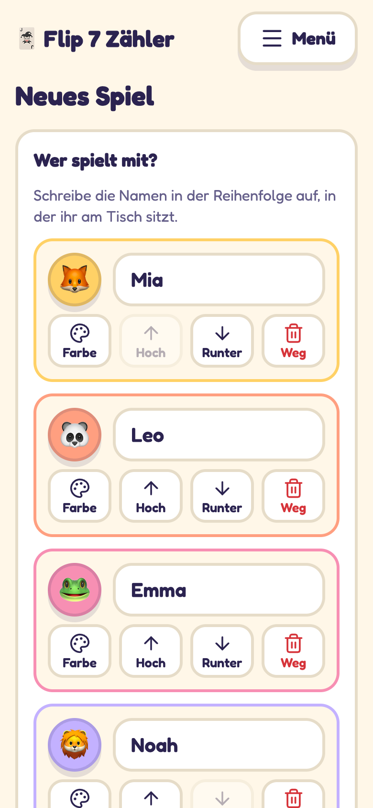
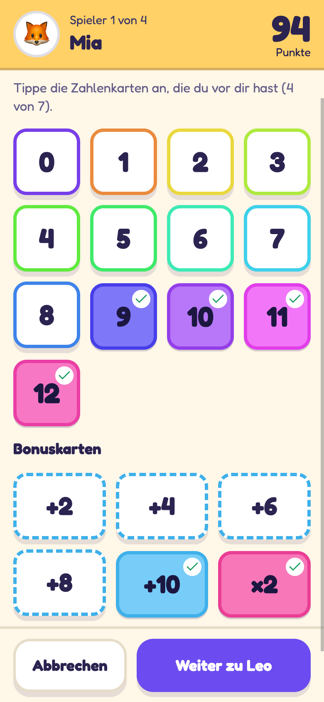
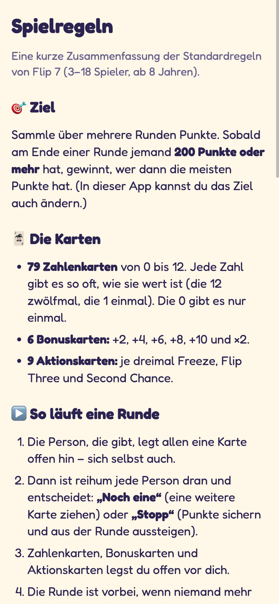

# Flip 7 Zähler

Ein kleiner, werbefreier Punktezähler für das Kartenspiel **Flip 7** – für Spielrunden mit den echten Karten. Die App rechnet mit, zeigt den Stand und erklärt die Standardregeln im Menü.

| Neues Spiel | Spielstand | Karten antippen | Siegerehrung | Regeln im Menü |
|:---:|:---:|:---:|:---:|:---:|
|  |  |  |  |  |

> Inoffizielle Fan-App, nicht verbunden mit The Op Games oder Kosmos. „Flip 7“ ist eine Marke der jeweiligen Rechteinhaber.

## Funktionen

- 2–18 Spieler mit Tier und Farbe, Ziel wählbar (Standard 200 Punkte), Geber-Anzeige.
- Runde eintragen per Kartenwahl (Zahlen 0–12, Bonuskarten +2 … +10 und ×2). Die App rechnet live, erkennt das Flip 7 (+15) und kennt „Verzockt“. Alternativ die Punkte über eine große Zifferntastatur eintippen.
- Runden nachträglich korrigieren, letzte Runde rückgängig machen.
- Spielende mit Siegerehrung; Gleichstand an der Spitze führt zu einer weiteren Runde.
- Verlauf und Statistik beendeter Spiele, Spielregeln im Menü (auf Deutsch).
- Hell/Dunkel, große Schrift, Bildschirm wachhalten, installierbar und offline nutzbar (PWA).
- Kinderfreundlich: große Tippflächen, nur einfache Taps, alles lässt sich korrigieren.
- Kein Backend, kein Konto, kein Tracking: alle Daten bleiben im `localStorage` des Browsers. Die Schrift wird selbst ausgeliefert.

## Entwicklung

```bash
npm install
npm run dev      # Entwicklungsserver
npm test         # Unit-Tests (Punkteberechnung, Spiellogik)
npm run build    # Produktions-Build nach dist/
```

Stack: React, TypeScript, Vite, `vite-plugin-pwa`, Vitest.

## Selbst hosten

Die App ist statisch (nginx im Container). Das Beispiel-`docker-compose.yml` ist für Traefik v2 gedacht und liest den Hostnamen aus einer `.env`:

```bash
cp .env.example .env     # APP_HOST usw. anpassen
docker compose up -d --build
```

Es setzt ein sehr kleines Request-Limit pro Besucher-IP (30 pro Minute, Burst 60). Für andere Reverse Proxys genügt das nginx-Image aus dem `Dockerfile`, es lauscht auf Port 80.

`scripts/deploy.sh` (`npm run deploy`) automatisiert Build, rsync auf einen Server per SSH und die Prüfung der ausgelieferten Version; die Zielwerte stehen in der lokalen `.env`.

## Lizenz

[MIT](LICENSE)
